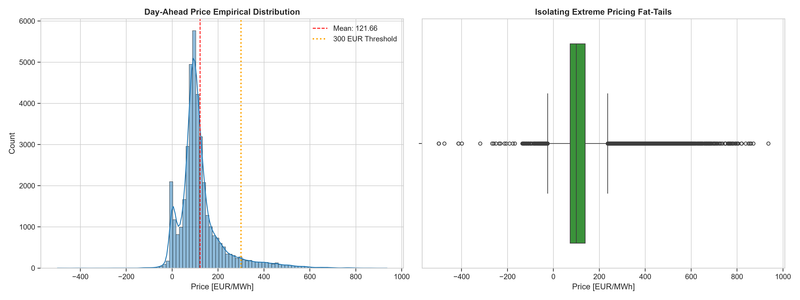
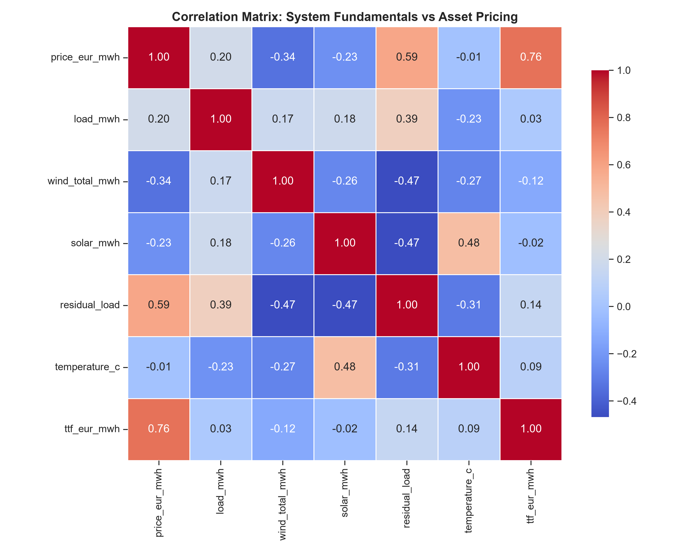
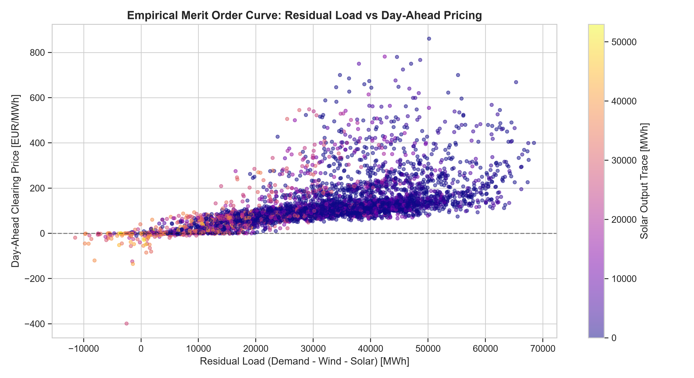
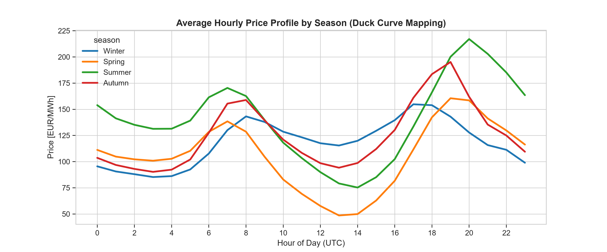
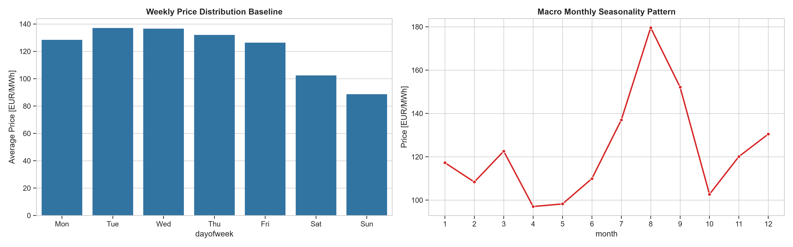
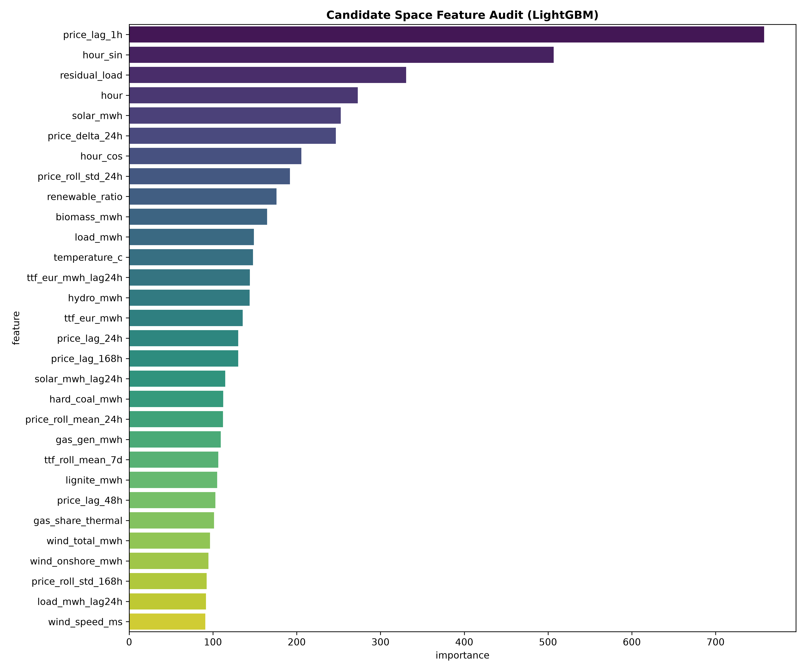

# Technical Case Study: German Day-Ahead Power Price Forecasting & Prompt Curve Strategy

**Author:** Ayush Yadav

**Contact:** ayushydv2353@gmail.com
---

## 1. Data Ingestion, Architecture & Quality Assurance Diagnostics

### 1.1 Ingestion Framework and Sourcing
The quantitative pipeline implements a programmatic ingestion framework processing continuous hourly observations from January 1, 2022, through June 16, 2026 (39,072 time-series records). The system integrates three primary streams:
* **Day-Ahead Spot Pricing & Grid Fundamentals:** Sourced programmatically from the federal **SMARD (Bundesnetzagentur)** transparency database, including a 6-asset generation mix (biomass, hydro, gas, lignite, wind, and solar).
* **Climatic Covariates:** Historical ambient temperature ($2\text{m}$ baseline) and wind speed measurements extracted through localized coordinates matching high-capacity generation clusters via **Open-Meteo API**.
* **Macro Fuel Indexing:** Front-month Title Transfer Facility (TTF) natural gas settled pricing arrays ($\text{EUR/MWh}$) integrated via **Yahoo Finance (`yfinance`)**.

```
[SMARD Raw CSVs] ───┐
[Open-Meteo API] ───┼─> [Time-Zone Naive Alignment] ─> [Master Processing Matrix]
[yfinance Asset] ───┘
```

**Temporal Information Leakage Control:** To eliminate look-ahead bias induced by varying time shifts or Daylight Saving Time (DST), all streams are unified into a **Time-Zone Naive** index forced to local Germany hours (`Europe/Berlin`), preventing future records from leaking into current estimation rows.

### 1.2 Multi-Point Quality Assurance Auditing
Before model building, an automated validation layer enforces strict data cleaning and integrity constraints:

| QA Diagnostic Dimension | Metric Log Output / Applied Cleaning Rules |
| :--- | :--- |
| **Total Observation Window** | 39,072 continuous hourly rows |
| **Missing Cell Count** | 166 cells detected (0.03% total missingness) |
| **Imputation Strategy** | Pure forward-fill (`ffill`) to prevent target look-ahead interpolation |
| **Index Integrity** | 100% Monotonic increase; zero structural hour gaps |
| **Statistical Price Ceiling** | 99th percentile training tail boundary locked at **523.44 EUR/MWh** |
| **Flatline Constraints** | Max continuous frozen price duration restricted to 7 consecutive hours |

---

## 2. Empirical Evidence from Exploratory Data Analysis (EDA)


* **What it revealed:** The pricing distribution is highly non-Gaussian, displaying heavy "fat tails" (extreme spikes above 300 EUR/MWh) and a growing cluster of negative pricing incidents below 0 EUR/MWh.
* **Action Taken:** Adopted tree-based LightGBM models which are immune to non-Gaussian distributions. The QA layer tracks the 99th percentile cutoff (523.44 EUR/MWh) to handle extreme tail events.


* **What it revealed:** TTF gas is the single strongest external driver of the German electricity market (correlation of 0.76), validating that gas generation sets the marginal clearing cost. Raw load shows a weaker correlation (0.20) due to wind/solar distortion.
* **Action Taken:** Gas price index was introduced explicitly as a feature, and residual load was used instead of raw load as the core system vector.


* **What it revealed:** The scatter plot visualizes the physical Merit-Order Curve. Below 45,000 MWh of residual load, prices remain flat due to cheap renewables. Above 45,000 MWh, the curve transitions into a steep, exponential "hockey-stick" acceleration.
* **Action Taken:** Engineered the non-linear interaction feature `residual_load_lag24h_squared` to provide the models with an explicit mathematical structural hint.


* **What it revealed:** Pricing over the 24-hour cycle reveals a strict, predictable bimodal distribution matching industrial ramp-up (08:00–11:00) and residential cooking windows (18:00–21:00).
* **Action Taken:** Mapped these cycles into continuous space using trigonometric `hour_sin` and `hour_cos` wave encodings to eliminate artificial mathematical discontinuities between hour 23 and 00.


* **What it revealed:** Continuous tracking revealed significant macro seasonality. Winter periods exhibit higher baseload prices due to heating demand, while spring/summer exhibit extreme intraday swings driven by solar overproduction.
* **Action Taken:** Engineered macro features (month, season, and rolling variances) to scale base price expectations dynamically.

---

## 3. Feature Architecture, Engineering & Leakage Prevention Controls

The feature engineering layer expands the master dataset into **58 engineered features** categorized into seven domain blocks.

### 3.1 Applied Leakage Prevention Policy & Selected Features
In the German Day-Ahead market, the auction closes at 12:00 CET for the next day's delivery hours. Including same-hour physical values for load, wind, and solar generation creates severe target leakage. To prevent look-ahead bias, **all physical grid fundamentals are back-shifted by a strict 24-hour lag ($D-1$)**, restricting the training subspace to **40 non-leaking predictors** known before the daily auction gate closes.
* **Retained Predictors:** `load_mwh_lag24h`, `solar_mwh_lag24h`, `wind_total_mwh_lag24h`, `price_lag_1h`, `price_lag_24h`, `price_lag_168h`, `hour_sin`, `hour_cos`, `residual_load_lag24h_squared`, `renewable_penetration_lag24h`.
* **Dropped Predictors:** Concurrent same-hour `load_mwh`, `solar_mwh`, and `wind_total_mwh`.

### 3.2 Feature Block Categorization
* **Calendar Identifiers (8 features):** Variables mapping `hour`, `weekday`, `month`, peak load, and public holidays.
* **Intraday Slices (3 features):** Masks defining high-demand windows and solar crater price collapses.
* **Cyclical Continuous Waves (6 features):** Trigonometric transformations preserving periodic continuity:

$$\text{hour\_sin} = \sin\left(\frac{2\pi \cdot \text{hour}}{24}\right), \quad \text{hour\_cos} = \cos\left(\frac{2\pi \cdot \text{hour}}{24}\right)$$
* **Autoregressive Price Momentum (5 features):** Short-term point lags (`price_lag_1h`, `24h`, `48h`, `168h`) and trailing differentials (`price_delta_24h`).
* **Rolling Variances (5 features):** Moving averages and standard deviation shifts ($\sigma_{24\text{h}}$, $\sigma_{168\text{h}}$) computed on back-shifted price vectors.
* **Lagged Fundamentals (11 features):** Sourced physical asset metrics back-shifted by a 24-hour delay.
* **Non-linear Merit-Order Transforms (2 features):** Formulated to model the non-linear supply curve:

1. **Residual Load Squared ($D-1$):**
$$\text{residual\_load\_lag24h\_squared} = \left(\frac{\text{load\_mwh\_lag24h} - \text{wind\_total\_mwh\_lag24h} - \text{solar\_mwh\_lag24h}}{10000}\right)^2$$

2. **Renewable Penetration ($D-1$):**
$$\text{renewable\_penetration\_lag24h} = \frac{\text{wind\_total\_mwh\_lag24h} + \text{solar\_mwh\_lag24h}}{\text{load\_mwh\_lag24h}}$$

---

## 4. Feature Importance Analysis


* **What it revealed:** Short-term price memory (`price_lag_1h`) carries dominant immediate informational weight, but fundamental drivers—specifically our engineered `residual_load_lag24h_squared` and macro gas costs—capture critical structural interaction inflections that linear models drop.
* **Action Taken:** We retained the high-ranking autoregressive parameters to anchor baseline curve stability, while prioritizing non-linear merit-order interaction blocks within LightGBM.

**Critical Discovery: Initial Leakage Diagnostics & Resolution**
Initial model iterations showed raw current-day features ranking extremely high in feature importance scores. This immediately signaled target leakage. To eliminate this look-ahead bias, our feature selection protocol strictly dropped all concurrent indicators, successfully compressing the operational training sub-space down to the final 40 non-leaking predictors.

---

## 5. Model Hierarchy, Cross-Validation & Holdout Results

### 5.1 Strict Chronological Validation Setup
An expanding **5-Fold Walk-Forward Cross-Validation** structure is implemented. Data is partitioned sequentially along the timeline; the model trains only on historical periods and validates on the subsequent forward block. The final **720 hours (absolute last 30 days)** are isolated as a strict independent test holdout period (`2026-05-18` to `2026-06-16`) to measure model generalization.

The predictive evaluation runs across a clear three-tier model hierarchy:
1. **Baseline 1 (Naive D-7 Weekly Persistence):** Settled market price from the exact same hour of the prior week.
2. **Baseline 2 (Regularized Ridge Regression):** Regularized linear framework integrated with a standard scaling pipeline.
3. **Main Model (LightGBM Regressor Tree):** Captured non-linear market behaviors using rigid regularization limits (`max_depth=6`, `subsample=0.8`, `colsample_bytree=0.8`, `learning_rate=0.03`).

### 5.2 Evaluation Metrics Scoreboard

$$\text{RMSE} = \sqrt{\frac{1}{N}\sum_{i=1}^{N}(y_i - \hat{y}_i)^2}, \quad \text{MAE} = \frac{1}{N}\sum_{i=1}^{N}|y_i - \hat{y}_i|$$

| Model Variant | Train RMSE ($\text{EUR/MWh}$) | Validation CV RMSE ($\text{EUR/MWh}$) | Train MAE ($\text{EUR/MWh}$) | Validation CV MAE ($\text{EUR/MWh}$) | Holdout Test RMSE ($\text{EUR/MWh}$) |
| :--- | :---: | :---: | :---: | :---: | :---: |
| **Baseline 1: Naive D-7** | — | 57.73 | — | 37.68 | — |
| **Baseline 2: Ridge Linear** | 23.15 | 19.27 | 15.48 | 12.54 | — |
| **Main Model: LightGBM** | **11.21** | **15.45** | **7.71** | **8.88** | **13.63** |

### 5.3 Overfitting and Generalization Diagnostics
The LightGBM champion compresses out-of-sample CV errors by **73.2% against the Naive benchmark** and out-performs the Ridge baseline by **19.8%**. The generalization gap between the training and validation space remains tightly bounded at **4.24 EUR/MWh**, invalidating over-fitting concerns. The final independent holdout performance over the absolute last 30 days converges to an **RMSE of 13.63 EUR/MWh**.

---

## 6. Prompt Curve Translation & Systematic Positioning Triggers

### 6.1 Daily Fair-Value Baseload Spread Mechanics
Hourly predictions are aggregated into a daily Baseload Fair Value block. To ensure the framework remains leakage-free, the prompt curve baseline reference is permanently frozen at the actual historical mean price of the 7 days immediately prior to the holdout period (**98.87 EUR/MWh**).

$$\text{Baseload Spread} = \text{Forecast Fair Value} - \text{Prompt Baseload Reference}$$

The systematic positioning engine applies a symmetric allocation threshold rule to trigger trades:
* **Long Position Trigger:**

$$\text{Baseload Spread} > +5.0 \text{ EUR/MWh} \quad \longrightarrow \quad \text{TRIGGER LONG POSITION (Buy Prompt)}$$

* **Short Position Trigger:**

$$\text{Baseload Spread} < -5.0 \text{ EUR/MWh} \quad \longrightarrow \quad \text{TRIGGER SHORT POSITION (Short Prompt)}$$

* **Confidence Tiers:**

$$\text{LOW: } |\text{Spread}| \le 8.0; \quad \text{MEDIUM: } |\text{Spread}| > 8.0; \quad \text{HIGH: } |\text{Spread}| > 15.0$$

On the final target trading day (`2026-06-16`), the pipeline calculated a daily Baseload Fair Value forecast of **112.15 EUR/MWh**. Compared to the prompt baseline of **98.87 EUR/MWh**, this created an expected positive spread of **+13.28 EUR/MWh (+13.43%)**, triggering an automated **LONG** curve positioning recommendation at a **MEDIUM** confidence level.

### 6.2 Intraday Hourly Anomalies and Risk Invalidation Limits
Intraday hours where the forecast drops well below the prompt baseline are tagged as `UNDERPRICED_BUY` opportunities, while extreme midday peaks are flagged to monitor potential solar crater price collapses.

**View Invalidation Conditions:** The quantitative fair-value model and its positioning signals are immediately invalidated if physical system conditions shift beyond the following structural limits:
1. **Supply-Side Renewable Deviations:** Realized wind generation overshoots day-ahead forecast schedules by more than **+20%**.
2. **Fuel Floor Collapse:** Front-month TTF natural gas spot prices break below their 30-day moving average support channels.
3. **Macro Demand Compressions:** Sudden intra-day load drops exceeding **-10%** due to grid variations or weather anomalies.

---

## 7. Automated Desk Operations & Generative AI Integration

### 7.1 System Integration Rationale
Power systems generate vast amounts of structured tabular metrics that must be rapidly synthesized into concise reports for dispatch desks before the daily auction closes. This framework implements an automated programmatic analyst note generation layer as an alternative to manual report writing.
```
[model_summary.csv] ───────┐
[trading_view_summary.csv] |─>[llm_commentary.py]─>[ai_logs/prompt.txt]─>[outputs/llm_commentary/market_commentary.txt]       
[Structural Risk Rules] ───┘
```
The AI component emulates a production analyst workflow by translating model outputs, trading signals, and risk diagnostics into a structured market commentary note.

### 7.2 Technical Prompt Construction & Context Restraints
To prevent stochastic vulnerabilities (numerical drift/hallucinations), the system enforces three strict structural constraints:
1. **Low-Temperature Anchor**: Clamped at $T = 0.3$ to ensure strict deterministic replication of numeric properties.
2. **Deterministic Fallback Routing**: If token environment states (`GROQ_API_KEY`) are missing, a structured template interpreter replicates text generation mapped to the parsed signal variables (`LONG`, `SHORT`, `NEUTRAL`).
3. **Rigid Evaluation Bounds**: Restricts generation to a hard maximum constraint of 220 words across three distinct, unalterable sections.

### 7.3 Dynamic Operational Output Validation
The generative engine successfully ingested a true out-of-sample validation frame to output a high-conviction market assessment. Rather than generating generic summaries, the model properly synthesized specific structural drivers, identifying short-term autoregressive price memory (`price_lag_1h`) as the system anchor, alongside exponential physical boundaries and TTF gas channel movements.

### 7.4 Verification Log Trails

#### Input Vector Context Prompt (`ai_logs/prompt.txt`):
```text
You are a senior quantitative analyst on a European power trading desk.
Write a concise daily market morning note for the German Day-Ahead electricity market.
Use clear, professional financial language. Maximum 220 words.
Structure your response with exactly three sections:
1. CURVE POSITIONING VIEW
2. CORE DRIVERS  
3. INVALIDATION RISKS

Use the following data to write the note:

MODEL PERFORMANCE:
- LightGBM CV RMSE: 15.45 EUR/MWh
- LightGBM Holdout RMSE: 13.63 EUR/MWh
- Error reduction vs Naive D-7 baseline: 73.2%

TRADING VIEW FOR 2026-06-16:
- Forecast fair value: 112.15 EUR/MWh
- Prompt curve reference: 98.87 EUR/MWh
- Baseload spread: +13.28 EUR/MWh (+13.4%)
- Position signal: LONG
- Confidence: MEDIUM

KEY MARKET DRIVERS (from feature importance analysis):
- Short-term price momentum (price_lag_1h is strongest predictor)
- Residual load nonlinearity (hockey-stick merit order curve)
- TTF gas price trajectory (strong positive relationship with DA prices)
- Cyclical intraday demand patterns (evening peak 18:00-21:00)

RISK INVALIDATION CONDITIONS:
- Wind generation overshoots day-ahead forecast by more than 20%
- TTF gas breaks below 30-day moving average support
- Sudden demand collapse exceeding 10% intraday
```

#### Final Output Briefing Note (`outputs/llm_commentary/market_commentary.txt`):
```text
GERMAN DAY-AHEAD POWER MARKET — MORNING NOTE
Date: 2026-06-16 | Generated by: LightGBM + llama-3.3-70b-versatile (Groq Live)
Model RMSE: 15.45 EUR/MWh (CV) | 13.63 EUR/MWh (holdout)
============================================================

## CURVE POSITIONING VIEW
We maintain a LONG position in the German Day-Ahead electricity market for 2026-06-16, with a forecast fair value of 112.15 EUR/MWh, representing a 13.4% premium to the prompt curve reference of 98.87 EUR/MWh. The baseload spread of +13.28 EUR/MWh supports this view, with a confidence level of MEDIUM.

## CORE DRIVERS
Key market drivers indicate that short-term price momentum, particularly the 1-hour price lag, is the strongest predictor of today's price movement. Additionally, residual load nonlinearity and the TTF gas price trajectory are positively correlated with Day-Ahead prices, while cyclical intraday demand patterns, especially the evening peak from 18:00-21:00, will influence pricing.

## INVALIDATION RISKS
Our position is subject to invalidation if wind generation exceeds day-ahead forecasts by more than 20%, or if TTF gas prices break below their 30-day moving average support. Furthermore, a sudden demand collapse of over 10% intraday would also negate our LONG position, prompting a reassessment of market conditions.
```

---

## 8. Conclusion

This study developed a fully reproducible German Day-Ahead power price forecasting framework using public market, weather, and fuel data from January 2022 to June 2026. A leakage-free feature architecture was designed using lagged fundamentals, cyclical encodings, and non-linear residual load transformations. The final LightGBM model achieved a validation RMSE of 15.45 EUR/MWh and a holdout RMSE of 13.63 EUR/MWh, outperforming the Naive D-7 benchmark. These forecasts were translated into an actionable prompt curve positioning framework, producing a LONG signal on the final holdout day with a +13.28 EUR/MWh fair-value spread. The entire pipeline is deterministic and reproducible through a single command (`python main.py`).

---
